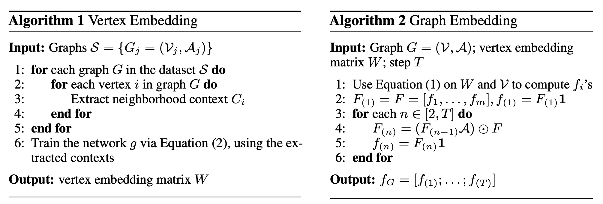

# N-Gram Graph

#### Authors: [Shengchao Liu](https://chao1224.github.io/), [Mehmet Furkan Demirel](http://pages.cs.wisc.edu/~demirel/), [Yingyu Liang](http://pages.cs.wisc.edu/~yliang/).

This is the source code for the paper
> Shengchao Liu, Mehmet Furkan Demirel, Yingyu Liang. N-Gram Graph: Simple Unsupervised Representation for Graphs, with Applications to Molecules. NeurIPS 2019 (Spotlight).

Prevailing methods for small-molecule property prediction are not quite stable, especially when we focus on each individual task for each datasets.

Here we propose another research line doing N-Gram representation on molecular graphs.
The motivation is that, instead of the K-hop neighborhood, the N-Gram path/walk provides a finer-grained view with more flexibility.
We also provide a solid analysis on the representation power of `N-Gram Graph`.

Another thing to point out is that the graph-level representation is indeed learning in an unsupervised (self-supervised) way.
The `N-Gram Graph` pipeline can be divided into three main parts:
1. Vertex embedding, unsupervised (self-supervised)
2. Graph embedding, unsupervised
3. A simple classifier




For the empirical results, `N-Gram Graph` with XGBoost is in top-1 for 21 out of 60 tasks, and is in top-3 for 48.
Recall that our setting is for each individual task, not for each dataset.
You can check the full paper on [NeurIPS proceedings](https://papers.nips.cc/paper/9054-n-gram-graph-simple-unsupervised-representation-for-graphs-with-applications-to-molecules) or [ArXiv](https://arxiv.org/abs/1806.09206).

## 1. Env Setup
Install Anaconda2-4.3.1 first, and below is an example on Linux.
```
wget https://repo.continuum.io/archive/Anaconda2-4.3.1-Linux-x86_64.sh
bash Anaconda2-4.3.1-Linux-x86_64.sh -b -p ./anaconda
export PATH=$PWD/anaconda/bin:$PATH
```

Then set up the env.
```
conda env create -f gpu_env.yml
source activate n_gram_project
pip install --user -e .
```

## 2. Data Preparation
```
cd datasets
bash download_data.sh
bash data_preprocess.sh
```

Below is the specification of all the datasets & tasks.

| Dataset | # of Tasks | Task Type |
| :---: | :---: | :---: |
| Delaney | 1 | Regression |
| Malaria | 1 | Regression |
| CEP | 1 | Regression |
| QM7 | 1 | Regression |
| QM8 | 12 | Regression |
| QM9 | 12 | Regression |
| Tox21 | 12 | Classification |
| Clintox | 2 | Classification |
| MUV | 17 | Classification |
| HIV | 1 | Classification |

## 3. Run Models

There are two `test.sh` scripts (under path `n_gram_graph/` and `n_gram_graph/embedding/`) for quick test on task `Delaney`.

#### 3.1 Run the Node-Level and Graph-Level Embedding

+ First specify the arguments.
```
cd n_gram_graph/embedding

export task=...
export running_index=...
```

+ Run the node-level embedding:
```
mkdir -p ./model_weight/"$task"/"$running_index"

python node_embedding.py \
--mode="$task" \
--running_index="$running_index"
```

+ Run the graph-level embedding:
```
mkdir -p ../../datasets/"$task"/"$running_index"

python graph_embedding.py \
--mode="$task" \
--running_index="$running_index"
```

Please check `run_embedding.sh` for detailed specifications.

#### 3.2 Run RF and XGB

+ First specify arguments.
```
cd n_gram_graph

export task=...
export model=...
export weight_file=...
export running_index=...
```

+ For classification tasks:
```
python main_classification.py \
--task="$task" \
--config_json_file=../config/"$model"/"$task".json \
--weight_file="$weight_file" \
--running_index="$running_index" \
--model="$model" 
```

+ For regression tasks:
```
python main_regression.py \
--task="$task" \
--config_json_file=../config/"$model"/"$task".json \
--weight_file="$weight_file" \
--running_index="$running_index" \
--model="$model" 
```

Please check `run_n_gram_classification.sh` and `run_n_gram_regression.sh` for detailed specifications.

## 4. Cite Us

```
@incollection{NIPS2019_9054,
    title = {N-Gram Graph: Simple Unsupervised Representation for Graphs, with Applications to Molecules},
    author = {Liu, Shengchao and Demirel, Mehmet F and Liang, Yingyu},
    booktitle = {Advances in Neural Information Processing Systems 32},
    editor = {H. Wallach and H. Larochelle and A. Beygelzimer and F. d\textquotesingle Alch\'{e}-Buc and E. Fox and R. Garnett},
    pages = {8464--8476},
    year = {2019},
    publisher = {Curran Associates, Inc.},
    url = {http://papers.nips.cc/paper/9054-n-gram-graph-simple-unsupervised-representation-for-graphs-with-applications-to-molecules.pdf}
}

```
